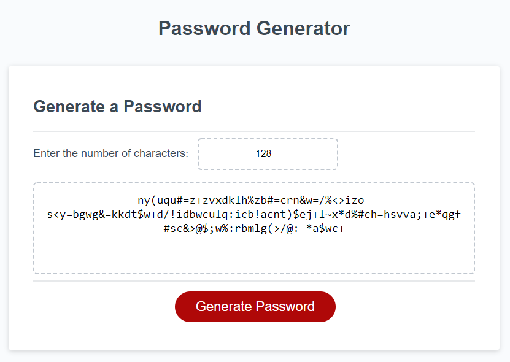

# 03 JavaScript: Password Generator

## Secure & super strong password Generator. 

That allows the user to select whether they want to include uppercase, lowercase, or special characters in the password.
As well as allowing the user to enter the number of characters of the password which is limited by 8 to 128 characters per requirement.

